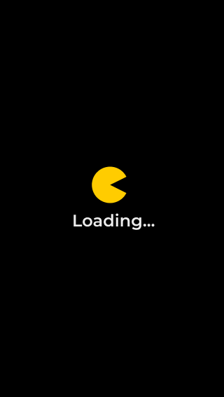
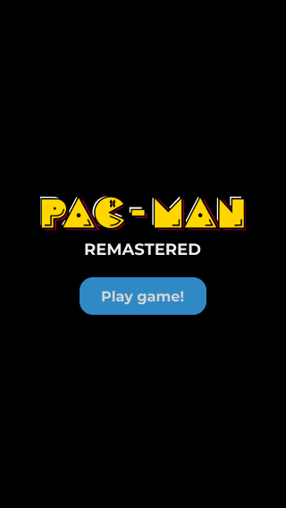
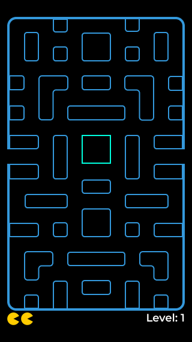
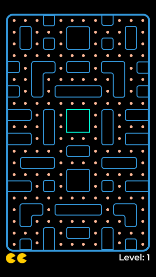
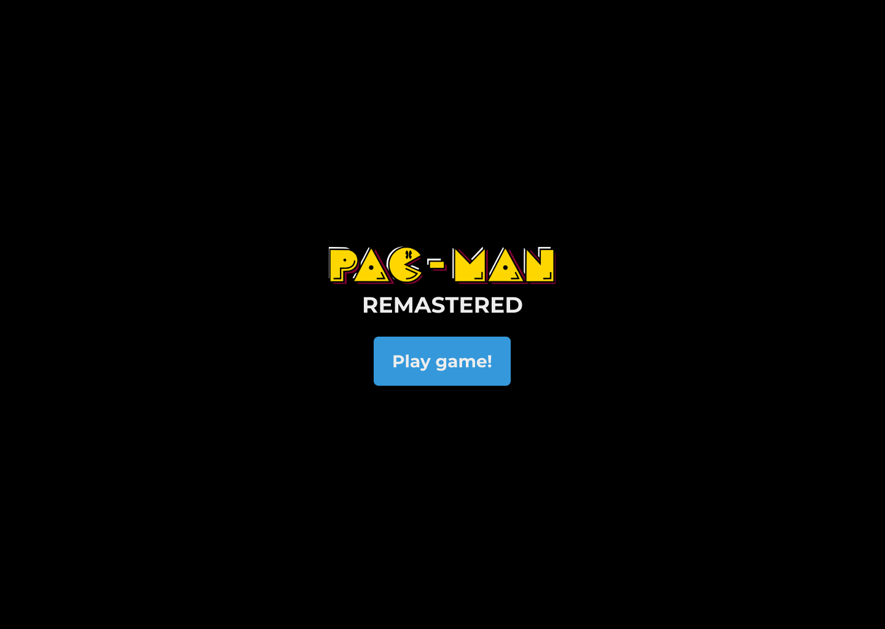
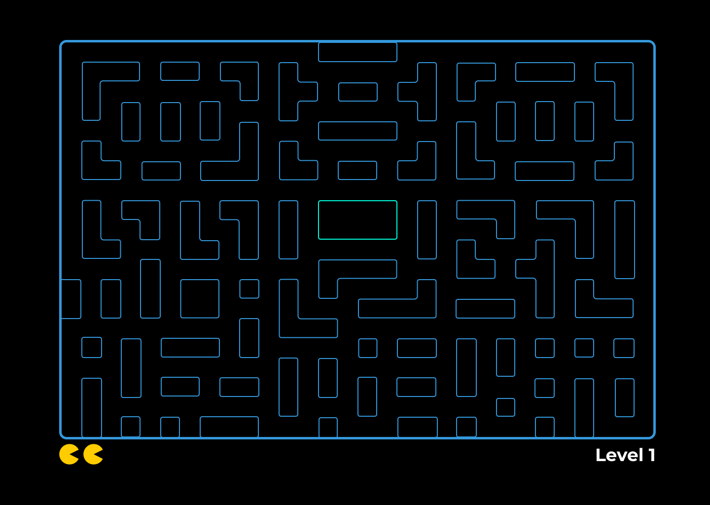
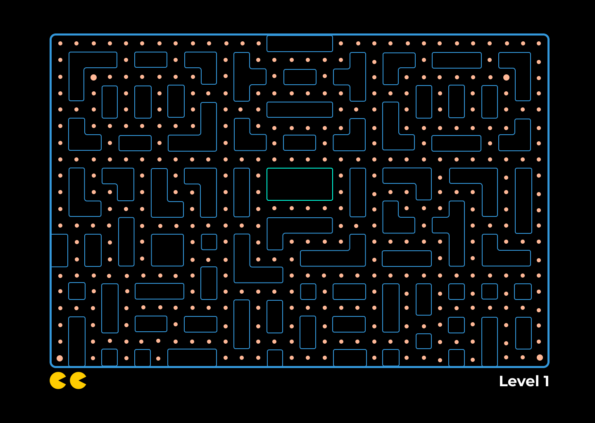

# Release date
The Release of this project will be on July 18th, 2021

# User Interface Design
For this project, there will be 4 different designs. Therefore, each one will be different.
## Why are there 4 different designs?
- The quantity of different devices is huge
- The responsive design doesn't apply when working with complex designs such as pacman arcade game
- In order to give a high-quality experience, the different designs are necessary.

## Sizes and specifications of the designs
### 320 Design
The first design was for the smallest size of mobile phones, the ones with 320px viewport-width.
The specifications of this design are the following:
- 12 colums of 24px each
- 20 rows of 24px each
- A border of 4px 
- In summary, 296px (width) x 488px (height)

### 375 Design
This design was created for the mobile devices with a viewport-width of 375px.
The specifications are the following:
- 14 columns of 24px each
- 23 rows of 24px each
- A border of 4px
- In summary, the game board is 344px (width) x 560px (height)

The design is similar to the one above

### Higher design
The higher design was created for the sake of huge mobile devices such as the iPhones with a height of 812px
Specifications:
- 14 columns of 24px each
- 29 rows of 24px each
- A border of 4px
- In summary, the game board is 344px (width) x 704px (height)

The design changes a little bit, but virtually it is pretty similar

### Tablet design
There is no tablet design yet. 80% of the internet traffic is by mobile devices. So, the project is focus on mobiles devices.

### Desktop design
The desktop design is my favorite one. It is pretty huge and comfortable.
Specifications:
- 30 columns of 40px each
- 20 rows of 40px each
- A border of 5px
- In summary, the game board is 1210px (width) x 810px (height)

# Technologies used
The game is a Single Page Application and the technologies used for this project are:
- Vanilla JavaScript
- CSS
- Html
- Webpack
- NPM
- Git & GitHub

# Files organization
The "design" folder contains all Figma design images. The "dist" folder is the one sent to production (that's the one webpack generates) and the "public" folder is unnecessary, but it is according to the "good practices".

Following the "good practices", there is a src directory where all the magic happens. Within it, we can find a lot of folders that I am going to explain:
- assets: All the images and gifs used in the game, as well as sounds
- pages: All the pages with the .js extension for the SPA
- routes: The router to move along the webpage
- styles: Styles
- Utils: Stuff necessary to getHash, goFullscreen or create the grid for the game

Finally, the index.js file in the src carpet is the one webpack takes to send to production

# How it works?
To understand how the program works, we need to know it is a Single Page Application where according to the size of the screen, it is displayed a different layout of the game.

All the logic if the game actually starts at the `src/routes/index.js` file. The file calls all the necessary pages of the program and stablish the layout (according to the size of the screen).
Afterwards, we have the `src/javascript/logic.js` file where it is imported the Pacman class in `src/javascript/Pacman.js`. The Pacman class has actually evetything needed for the pacman. From the controls for keyboard and touchScreen until the Win and Lose methods.

In summary, the logic.js file imports the Pacman class, which has all the magic.